# Trino MV Orchestrator — Learning Guide

A guided tour of the codebase, designed to take you from zero to "I can extend this safely" as quickly as possible. Read top to bottom on the first pass; later, treat it as a map.

---

## 1. The 60-Second Pitch

Trino's built-in materialized view (MV) refresh only handles **scan-filter-project**. Any `GROUP BY` triggers a **full source rescan**. For append-only analytics tables (trades, logs, events), that's terabytes of repeated work every refresh.

This project orchestrates **incremental** MV refreshes from the outside, using only **Iceberg metadata** — no source data is read during change detection. A typical detect-and-refresh cycle is ~50 ms of metadata work plus a partition-pruned `MERGE`.

**One-line summary:** *Metadata-driven, externally-orchestrated, incremental MV refresh for Trino on Iceberg.*

---

## 2. The Problem (Visual)

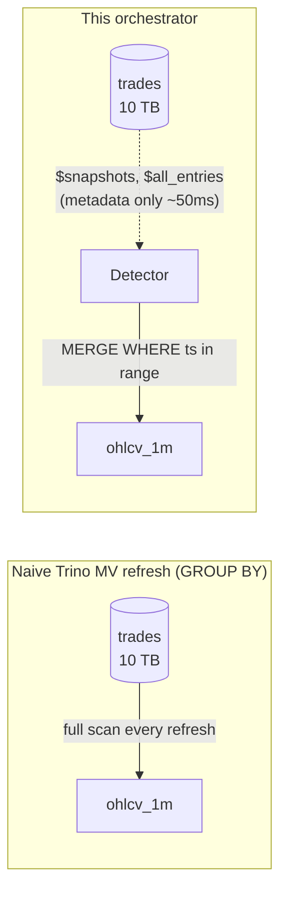

Detection touches no data. The `MERGE` only scans the partitions that intersect the changed time range.

---

## 3. The Five-Step Algorithm

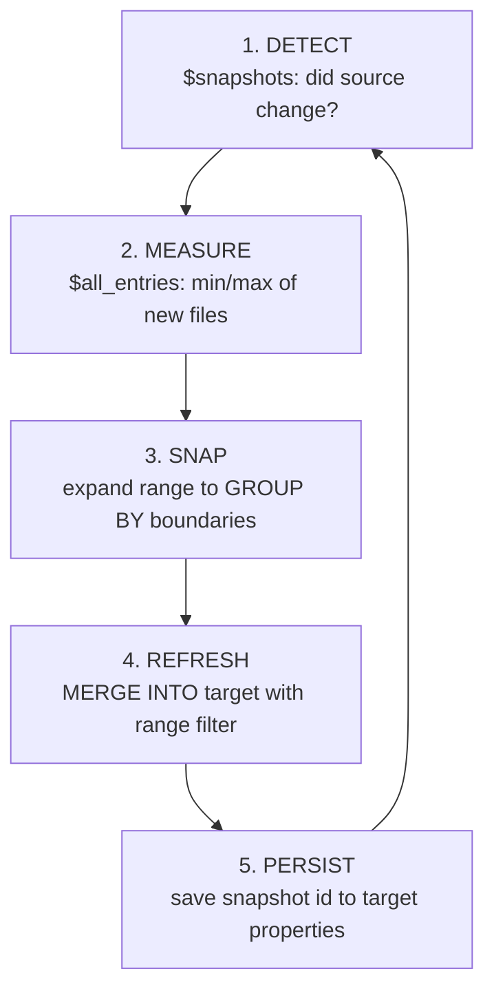

Every step is critical. **Step 3 (SNAP) is where most of the correctness work lives** — see §8.

---

## 4. High-Level Architecture

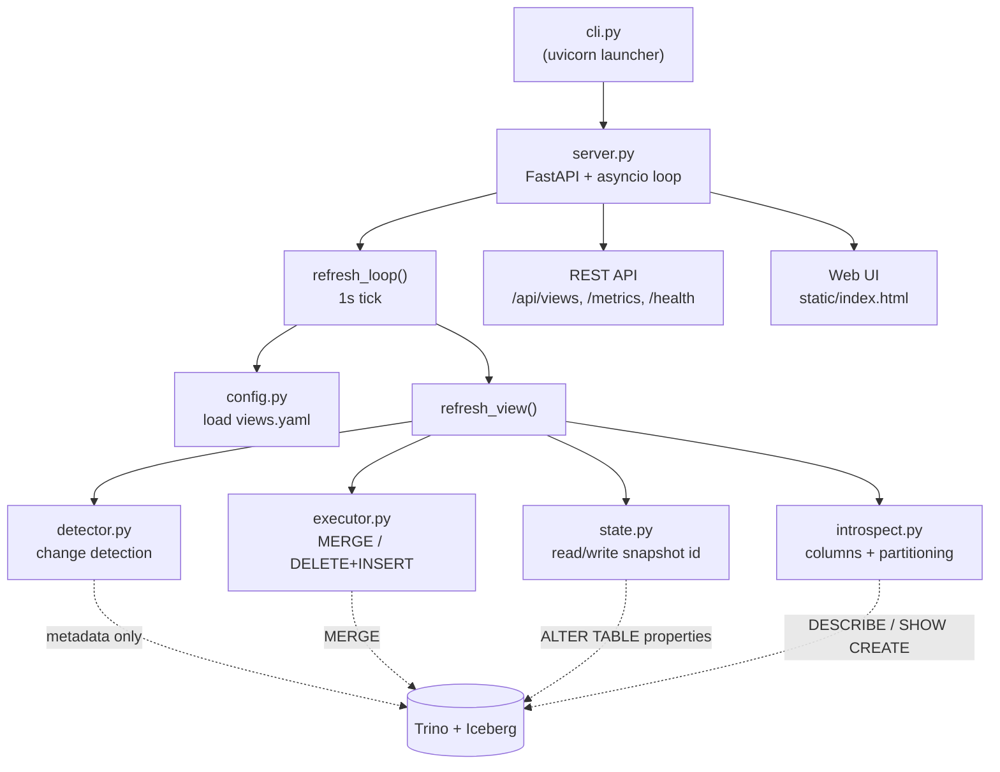

**Module responsibilities (one line each):**

| Module | Responsibility |
|---|---|
| `cli.py` | Parse args, launch uvicorn with FastAPI app |
| `server.py` | FastAPI app, refresh loop, REST API, Prometheus metrics |
| `config.py` | Load + validate YAML, infer granularity from `date_trunc()` |
| `detector.py` | Read `$snapshots` / `$all_entries`, decide refresh action, snap range |
| `executor.py` | Build & run `MERGE` / `DELETE+INSERT` SQL |
| `introspect.py` | Auto-discover query columns and source partitioning |
| `state.py` | Read/write `mv.last_source_snapshot` from target's Iceberg properties |

---

## 5. Lifecycle of a Single Refresh (Sequence)

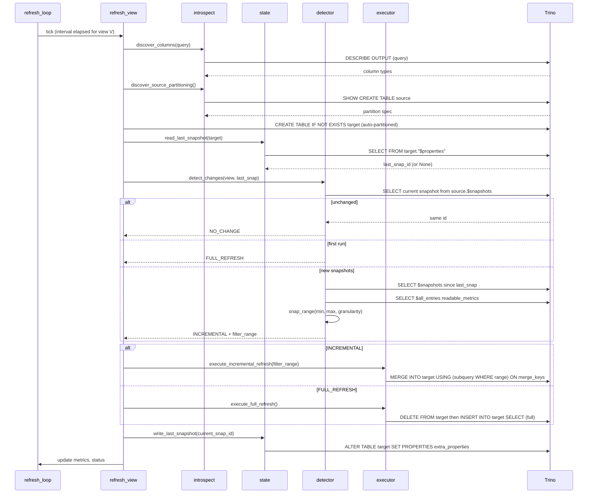

**Key insight:** detection is metadata-only. Real data is touched exactly once, inside the `MERGE`, and only for the snapped time range.

---

## 6. The Refresh Loop in Code

`server.py:264-286`

```python
while not s._stop:
    # Periodic config reload (default every 30s)
    if elapsed(config_reload_interval): reload_config(s)

    # Per-view scheduling
    for view in s.config.views:
        if elapsed(view.refresh_interval_seconds):
            await refresh_view(s, view)

    await asyncio.sleep(1)   # 1s tick
```

A single asyncio task does everything. No worker pool, no celery, no queue. Each view is scheduled by its own `refresh_interval_seconds`.

---

## 7. The Detector — State Machine

`detector.py:detect_changes()` returns one of three actions:

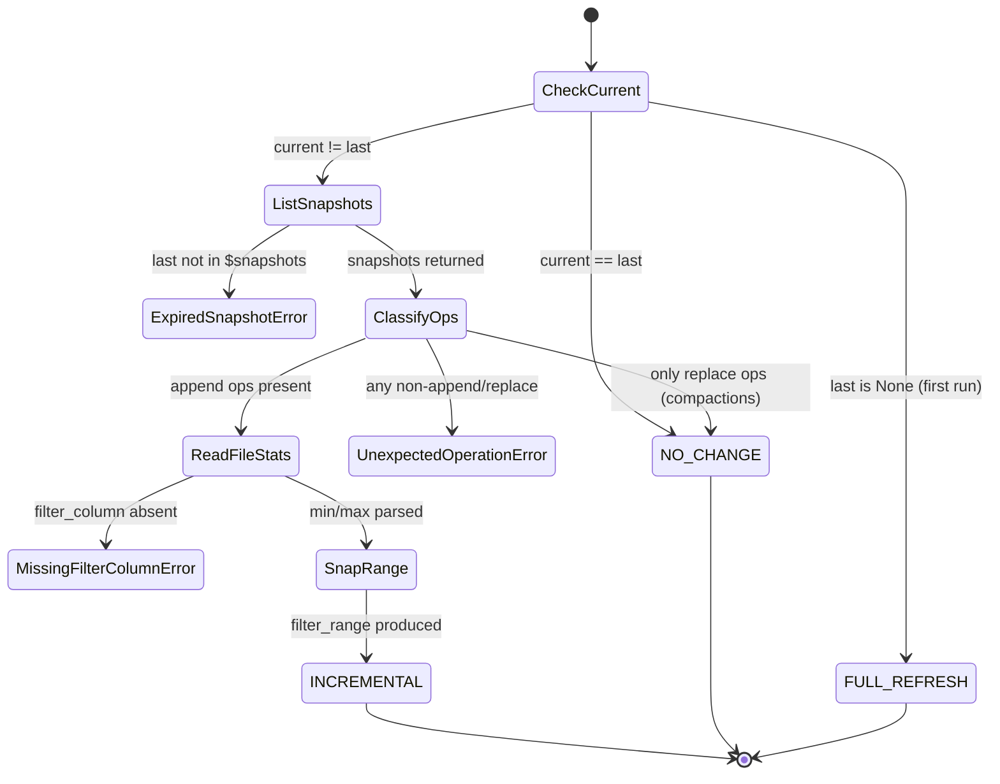

Three loud error types (`ExpiredSnapshotError`, `MissingFilterColumnError`, `UnexpectedOperationError`) replace silent failures that previously masqueraded as `NO_CHANGE`. **Loud failure is a feature** — see the project memory: *only `append` and `replace` are legitimate; anything else should fail loudly*.

---

## 8. `snap_range()` — The Heart of Correctness

`detector.py:221-273`. This is the single most important function in the codebase.

### The problem

`date_trunc('hour', ts)` is **many-to-one**:

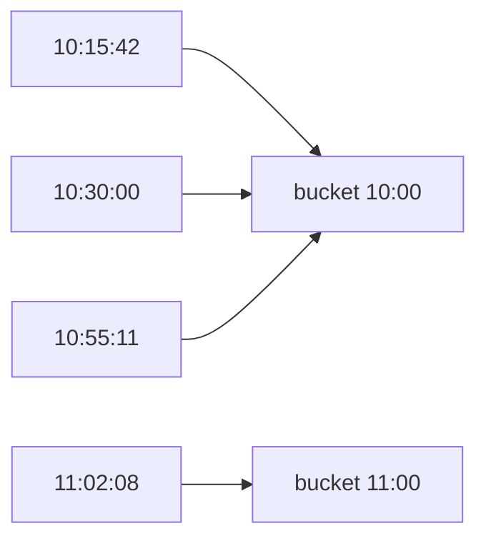

When a new file arrives with raw stats `min=10:15`, `max=11:02`, naively filtering `ts >= 10:15 AND ts < 11:02` would **truncate the 10:00 bucket** (missing rows at 10:00–10:14 from earlier files) and **truncate the 11:00 bucket** (missing rows at 11:02–11:59 in later files).

The result: partial buckets → wrong aggregates → silent data corruption.

### The fix

`snap_range` inverts `date_trunc` by snapping outwards:

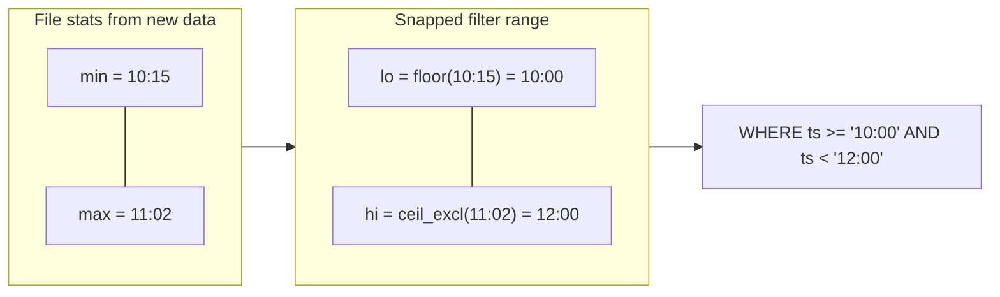

Now the `MERGE` reads **complete buckets**, recomputes them from scratch, and writes correct aggregates.

### Worked example: weekly bars from daily partitions

`tests/integration/test_cross_partition_groupby.py`

```
Day 1 (Mon Apr 6):  100 volume → full refresh, weekly bar = 100
Day 2 (Tue Apr 7):  200 volume → incremental, weekly bar = 300
Day 3 (Wed Apr 8):   50 volume → NEW snapshot

File stats (Wed):    ts ∈ [10:00, 10:30]
snap_range('week'):  [Mon Apr 6, Mon Apr 13)        ← full week
MERGE filter:        WHERE ts >= '2026-04-06' AND ts < '2026-04-13'
MERGE reads:         Mon + Tue + Wed = 350 ✓

(Without snap_range, would have read only Wednesday → 50 ✗)
```

---

## 9. The Executor

`executor.py` builds two SQL shapes.

### Full refresh (`execute_full_refresh`, lines 85-101)

```sql
DELETE FROM target WHERE true;
INSERT INTO target SELECT ... FROM source WHERE TRUE;
```

The view's query runs verbatim — no range predicate is injected for full refresh.

### Incremental refresh (`execute_incremental_refresh`, lines 104-131)

```sql
MERGE INTO target t
USING (
  SELECT ... FROM source
  WHERE ts >= TIMESTAMP '2026-04-06 00:00:00.000 UTC'
    AND ts <  TIMESTAMP '2026-04-13 00:00:00.000 UTC'
) s
ON t.symbol = s.symbol AND t.minute = s.minute
WHEN MATCHED THEN UPDATE SET ...
WHEN NOT MATCHED THEN INSERT (...) VALUES (...)
```

**Why MERGE works here:**

- `merge_keys` (e.g. `[symbol, minute]`) uniquely identify each output row.
- Trino pushes down the plain column comparison to **partition pruning** (no full scan).
- The whole MERGE is a single atomic Iceberg commit.

---

## 10. State Persistence

State lives **in the target table itself**, in Iceberg's `extra_properties`.

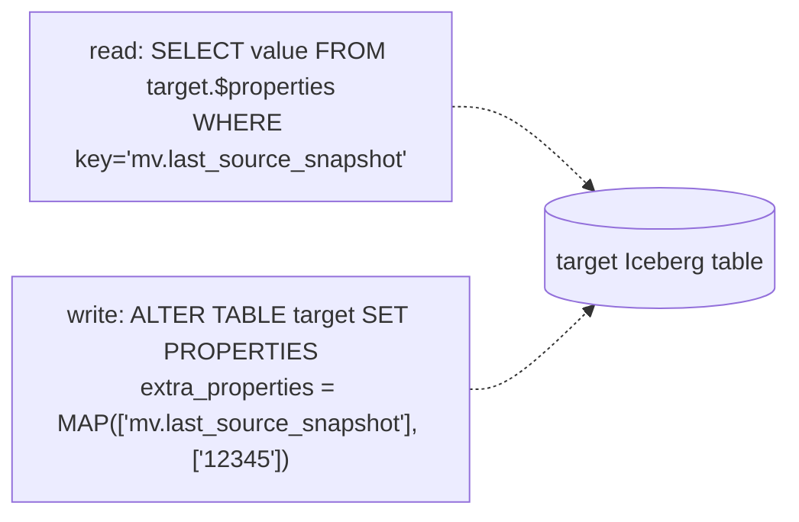

**Consequences of this design:**

- `DROP TABLE target` → state gone → next run does a full backfill. No external coordinator to clean up.
- Two separate commits per refresh (MERGE + ALTER). A crash in between means redundant work next cycle, not data loss.
- Requires Trino catalog config: `iceberg.allowed-extra-properties=mv.last_source_snapshot`.

---

## 11. Configuration

Two YAML files.

### `config.yaml` — connection + server

```yaml
server:
  port: 8000
  config_reload_interval_seconds: 30
trino:
  host: localhost
  port: 8080
  catalog: iceberg
  schema: analytics
  user: orchestrator
```

### Views — defined inline or in a separate `views.yaml`

```yaml
views:
  - name: ohlcv_1m
    query: |
      SELECT symbol, date_trunc('minute', ts) AS minute,
             min_by(price, ts) AS open, max(price) AS high,
             min(price) AS low, max_by(price, ts) AS close,
             sum(quantity) AS volume, count(*) AS trade_count
      FROM iceberg.market_data.trades
      GROUP BY symbol, date_trunc('minute', ts)
    refresh_interval_seconds: 60
```

Only two fields are required: `name` and `query`. The query is the full SELECT
as you'd write it after `CREATE MATERIALIZED VIEW … AS` — nothing else.

**Validation rules** (`query_parser.parse_view_query`, called from `config._parse_view`):

- Single SELECT, single FROM table (no JOIN, no UNION, no CTE, no subquery).
- Exactly one distinct `date_trunc('X', col)` — granularity and filter column
  are derived from it.
- `date_trunc` must not be wrapped in arithmetic.
- GROUP BY present; merge keys are resolved from it against the projection.
- Every computed projection column must have an explicit `AS alias`.
- `target_table` defaults to `{trino.catalog}.{trino.schema}.{view.name}`.
- `target_partitioning` defaults to source's partitioning (auto-discovered).

---

## 12. The Seven Correctness Fixes (commit `1dd764c`)

The branch you're on (`fix/incremental-correctness`) was born from spotting these. Each one is a class of subtle bug that produced silent wrong answers. Internalize them — they're the design rules of the system.

| # | Bug | Fix | File:Line |
|---|---|---|---|
| 1 | `readable_metrics` bounds compared as **lexicographic strings** (`"...T23:00"` > `"...T01:00"` lexically) | Parse all bounds through `_parse_ts()` to typed `datetime` immediately | `detector.py:162-196` |
| 2 | `get_snapshots_since()` returned `[]` when last_snap had **expired**, freezing the view forever | Detect missing snapshot, raise `ExpiredSnapshotError` | `detector.py:103-124` |
| 3 | `WHERE committed_at > X` dropped a snapshot if two committed in the **same millisecond** | Tiebreak on `(committed_at, snapshot_id)` | `detector.py:126-138` |
| 4 | Silent fallback to date-only parsing on format mismatch could shift the range by 24 hours | `_parse_ts` raises `ValueError` if no format matches | `detector.py:199-218` |
| 5 | Range filter formatted non-UTC datetimes as if they were UTC | Convert to UTC before formatting SQL literal | `executor.py:49-57` |
| 6 | Session timezone unset → Python snapped in UTC, Trino's `date_trunc` grouped in session tz → off-by-day | Pin `timezone='UTC'` on every aiotrino connection | `server.py:135-139` |
| 7 | Missing `filter_column` from file stats returned `NO_CHANGE`, masking config errors as "nothing happened" | Raise `MissingFilterColumnError`; advance state on legitimate `NO_CHANGE` (compactions) | `detector.py:188-192`, `server.py:221-225` |

The pattern across all seven: **silent fallback → loud, typed error**. Follow this pattern when extending.

---

## 13. REST API & UI

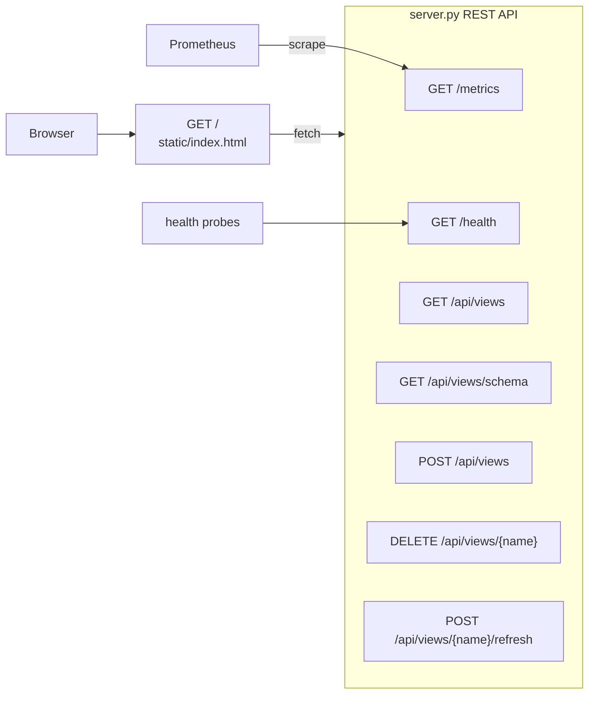

The UI is a single Alpine.js + Tailwind page. Form fields are driven by `/api/views/schema`, so adding a config field updates the UI automatically.

**Prometheus metrics worth knowing** (`server.py:40-67`):

- `mv_refresh_total{view, type}` — counts by `full | incremental | skip`
- `mv_refresh_duration_seconds{view}` — histogram
- `mv_detection_duration_seconds{view}` — should stay tiny (it's metadata-only)
- `mv_source_snapshot_id{view}` — current source snapshot, useful for alerting on staleness

---

## 14. Testing

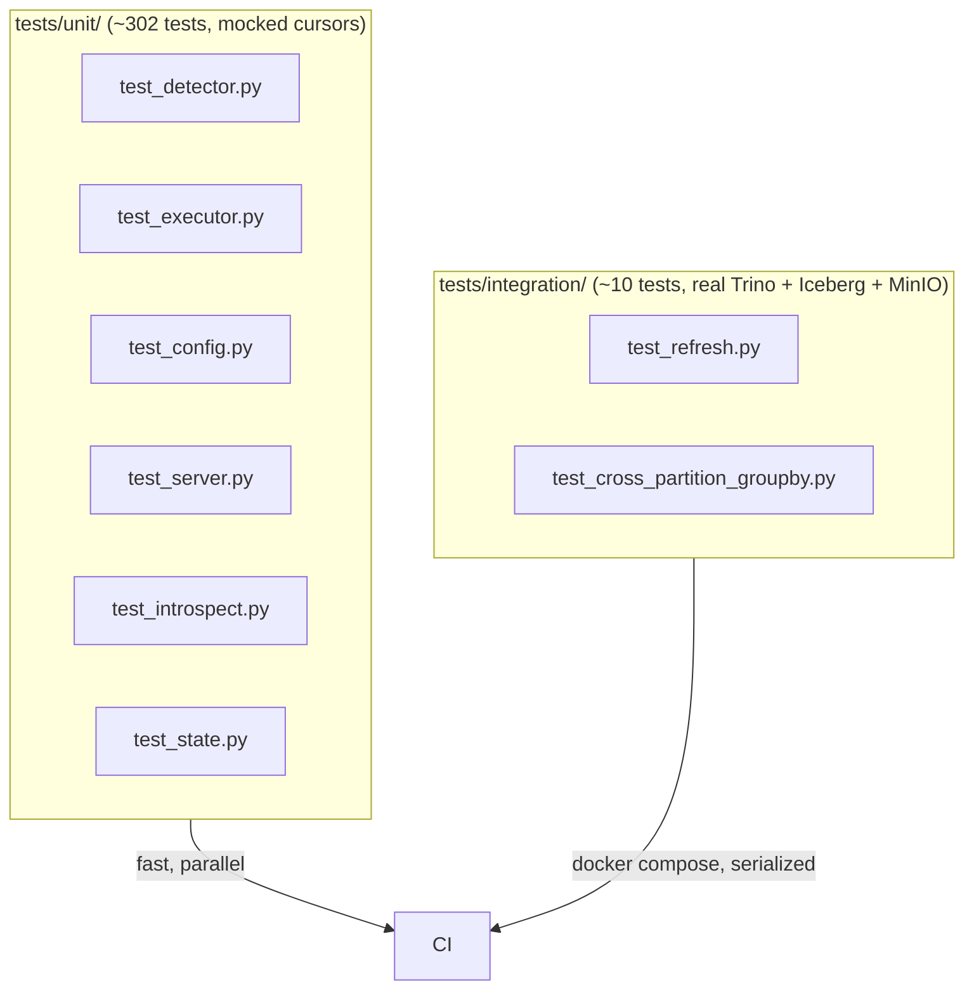

**Patterns:**

- Unit tests use a mock cursor with pre-loaded `fetchone/fetchall` results.
- Integration tests share one docker compose stack but serialize via `xdist_group("integration")` to avoid table-name collisions.
- For bug fixes: **write a clean failing test that reproduces the bug first** (per project memory).
- The canonical correctness test is `test_cross_partition_groupby.py:test_incremental_refresh_preserves_all_days` — it would fail without `snap_range`.

---

## 15. File Map (for jumping around)

| What | Where |
|---|---|
| Entry point | `src/trino_mv_orchestrator/cli.py:8-56` |
| FastAPI app + lifespan | `server.py:291-317` |
| Refresh loop | `server.py:264-286` |
| Per-view refresh | `server.py:177-262` |
| Change detection | `detector.py:276-351` |
| Snapshot enumeration | `detector.py:103-138` |
| File stats extraction | `detector.py:146-196` |
| **`snap_range`** | `detector.py:221-273` |
| Timestamp parsing | `detector.py:199-218` |
| Error types | `detector.py:24-72` |
| MERGE SQL | `executor.py:61-82` |
| Range filter | `executor.py:36-58` |
| Full refresh | `executor.py:85-101` |
| Incremental refresh | `executor.py:104-131` |
| Config loading | `config.py:140-173` |
| Granularity inference | `config.py:29-57` |
| View validation | `config.py:106-137` |
| State read/write | `state.py:16-37` |
| Column discovery | `introspect.py:31-39` |
| Partitioning discovery | `introspect.py:42-51` |

---

## 16. A Suggested Reading Order

1. `README.md` and `DESIGN.md` — the "why".
2. `config.yaml.example` — the user-facing surface.
3. `server.py:177-286` — `refresh_view` and `refresh_loop` (the orchestration spine).
4. `detector.py` end to end — most of the cleverness lives here.
5. `executor.py` — short, mostly SQL templating.
6. `tests/integration/test_cross_partition_groupby.py` — see the correctness invariant in action.
7. Re-read §12 above with the code open.

When you can answer *"what would break if `snap_range` returned the raw min/max?"* without looking, you understand the system.

---

## 17. Mental Model Summary

Three layers of correctness, each a separate failure mode:

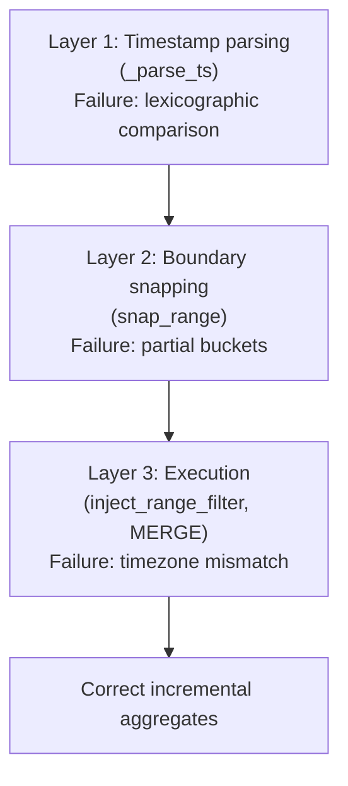

Get all three right and incremental MV refresh is just metadata + one partition-pruned MERGE per cycle. Get any one wrong and you get silent data corruption that's invisible until someone audits the totals.
