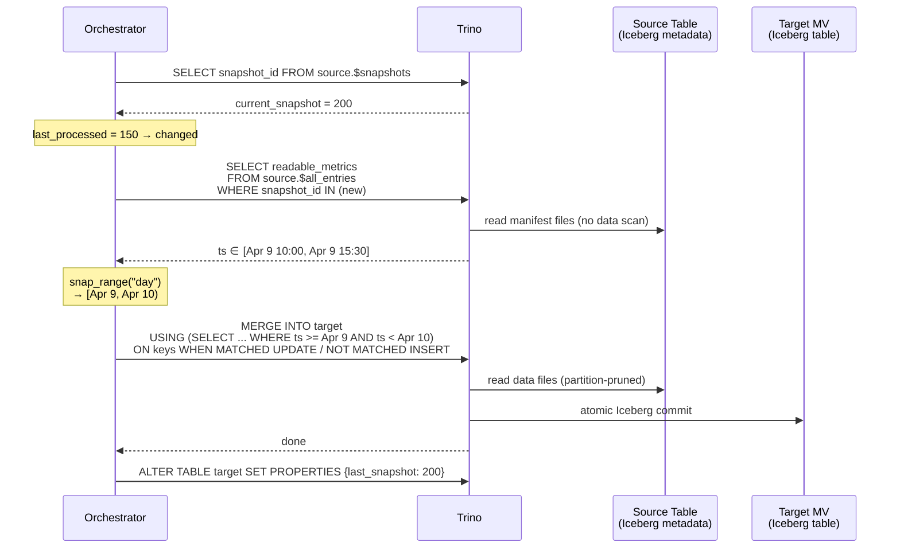
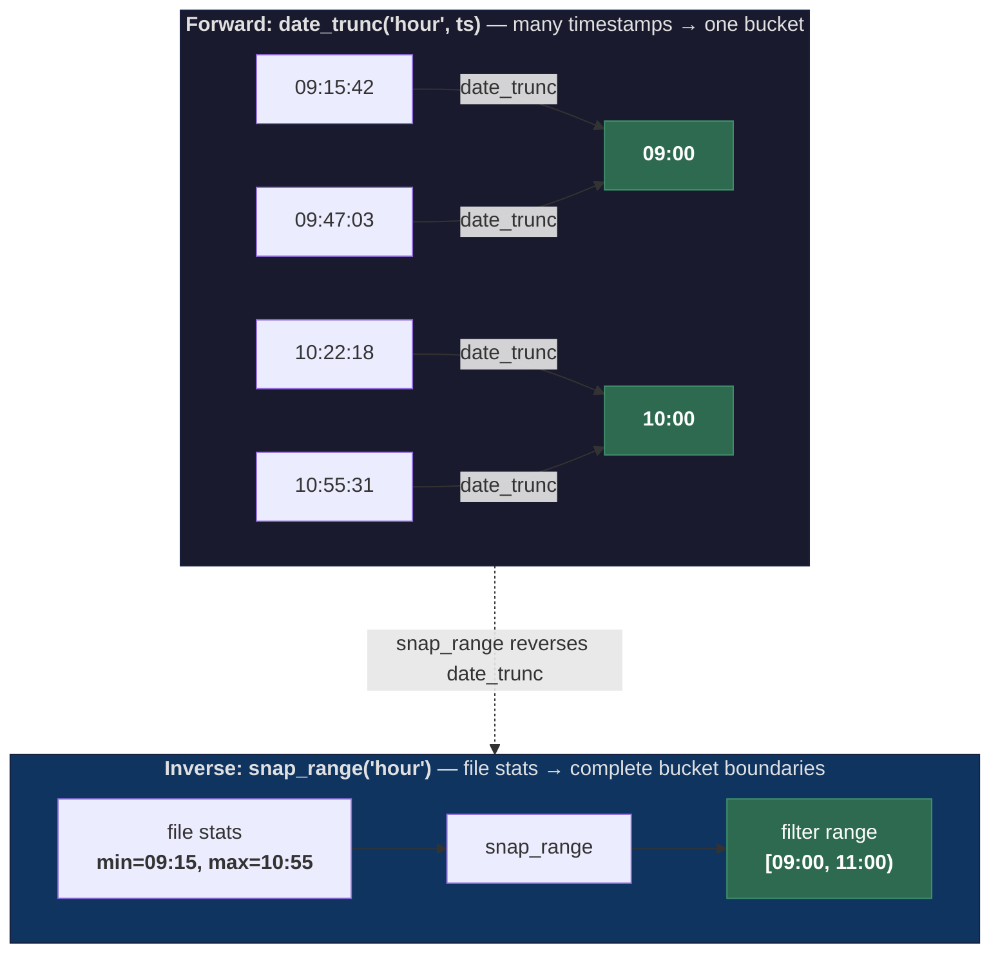
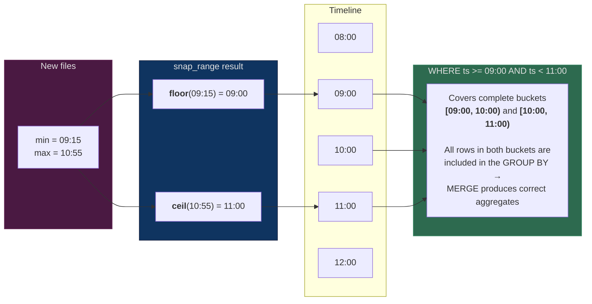
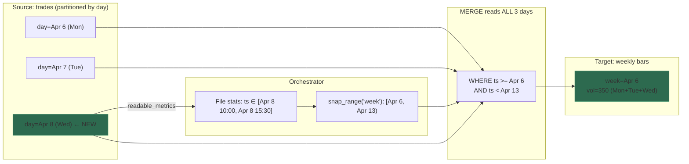

# trino-mv-orchestrator

Metadata-driven incremental materialized view orchestrator for Trino/Iceberg.

Maintains materialized views backed by Iceberg tables, refreshed incrementally
using only Iceberg file-level metadata for change detection. When source data
changes, only the affected time range is recomputed from complete source data,
guaranteeing correct aggregations. Refreshes are atomic via `MERGE INTO`.

> This project was designed and implemented through a conversation between a
> human prompter and Claude Code. See [DESIGN.md](DESIGN.md) for the full
> design rationale and conversation context.

## How it works



1. **Detect** -- query `$snapshots` to check if source changed (<50ms)
2. **Measure** -- read `$all_entries` for new files' column-level min/max bounds (metadata only)
3. **Snap** -- expand the time range to complete GROUP BY bucket boundaries (pure Python)
4. **Refresh** -- `MERGE INTO` with a plain column range filter (Trino pushes down to partition pruning)
5. **Persist** -- store snapshot ID in target table's Iceberg properties

### `date_trunc` and `snap_range`: forward and inverse

The entire incremental refresh correctness depends on one thing: given the
min/max timestamps from new files, compute a filter range that covers **every
complete GROUP BY bucket** touched by that data. This is done by inverting
the `date_trunc` function used in the query's GROUP BY.



`date_trunc` is a **many-to-one** function: it maps every timestamp within a
bucket to the same boundary value. `snap_range` is its inverse: it expands a
raw timestamp range outward to the nearest bucket boundaries so the filter
captures all rows that belong to any touched bucket.



The two operations mirror each other exactly:

| | `date_trunc('hour', ts)` | `snap_range('hour')` |
|---|---|---|
| **Direction** | timestamp → bucket start | timestamp range → bucket-aligned range |
| **Operation** | floor to `:00:00` | floor min to `:00:00`, ceil max to next `:00:00` |
| **Used in** | `GROUP BY` (query) | `WHERE` filter (orchestrator) |
| **Guarantees** | rows are grouped by hour | filter covers complete hours |

This is why only simple `date_trunc` is allowed: for any `date_trunc('X', col)`,
the inverse is trivially computable by `snap_range('X')`. Complex expressions
(e.g. 5-minute bars via arithmetic) break this — the bucket width can't be
reliably inferred, and the inverse would produce a too-narrow filter that
corrupts aggregates.

## Requirements

- **Trino ≥ 465** — `extra_properties` table-property support was added in 465 (see the prerequisite below).
- **Iceberg catalog supporting writes from Trino** — Hive Metastore, REST, Nessie, Polaris, Snowflake Open Catalog, or JDBC.
- **Trino user** with the following privileges:
  - `SELECT` on every source table (plus its `$snapshots`, `$all_entries`, `$properties` metadata tables — these inherit from the base-table grant in Trino's Iceberg connector).
  - `CREATE TABLE` on the target schema — the orchestrator creates the target on first refresh.
  - `SELECT`, `INSERT`, `DELETE`, `UPDATE` on every target table — needed for `MERGE` (incremental) and `DELETE + INSERT` (full refresh).
  - `ALTER TABLE` on every target table — state persistence via `SET PROPERTIES extra_properties = …`.
- **Iceberg column statistics** on the source `filter_column` — the detector reads `readable_metrics` from `$all_entries`. Statistics are on by default for Trino and Spark ≥ 3.5 writers.
- **Python ≥ 3.12** — only when running from source (the Docker image does not require this on the host).

## Quick start

### 1. Trino prerequisite

Refresh state (the last source snapshot processed) is persisted **inside the
target table** as an Iceberg custom property — so dropping the view cleans its
state up automatically, no sidecar DB needed. Trino's Iceberg connector ships
this as an opt-in feature: by default no custom property keys can be written
through `extra_properties`, so you need to allow `mv.last_source_snapshot` on
every catalog the orchestrator writes to:

```properties
# etc/catalog/iceberg.properties
iceberg.allowed-extra-properties=mv.last_source_snapshot
```

Without this, the state-writing `ALTER TABLE … SET PROPERTIES extra_properties
= …` fails, and the orchestrator will redo a full refresh on every cycle
because it can't remember where it left off.

**References** (Trino docs):

- [`iceberg.allowed-extra-properties`](https://trino.io/docs/current/connector/iceberg.html#general-configuration) —
  *"List of extra properties that are allowed to be set on Iceberg tables. Use
  `*` to allow all properties."*  Default: `[]`.
- [`extra_properties` table property](https://trino.io/docs/current/connector/iceberg.html#table-properties) —
  the per-table map we write the snapshot ID into.
- Introduced in [Trino 465](https://trino.io/docs/current/release/release-465.html)
  (2024-12-11): *"Add support for reading and writing arbitrary table properties
  with the `extra_properties` table property."*  Trino ≥ 465 is required.

### 2. Create two YAML files

**`config.yaml`** — Trino connection + server settings (see
[`config.yaml.example`](config.yaml.example) for a starting template):

```yaml
server:
  port: 8000
  config_reload_interval_seconds: 30
trino:
  host: localhost
  port: 8080
  catalog: iceberg
  schema: analytics
  user: orchestrator
```

**`views.yaml`** — the views to maintain. Write each `query` *exactly* as you
would after `CREATE MATERIALIZED VIEW … AS`:

```yaml
views:
  - name: ohlcv_1m
    query: |
      SELECT
        symbol,
        date_trunc('minute', ts) AS minute,
        min_by(price, ts) AS open, max(price) AS high,
        min(price) AS low,        max_by(price, ts) AS close,
        sum(quantity) AS volume,  count(*) AS trade_count
      FROM iceberg.market_data.trades
      GROUP BY symbol, date_trunc('minute', ts)
    refresh_interval_seconds: 30
```

The orchestrator parses each query and derives `source_table`, `filter_column`,
`filter_granularity`, and `merge_keys` from it. At refresh time the time-range
WHERE predicate is AST-injected automatically — there is no `{range_filter}`
placeholder. Column types are auto-discovered via `DESCRIBE OUTPUT` and the
target table is created on first run.

Views can also be managed interactively from the web UI.

### 3. Run it

Install dependencies and start the service:

```bash
uv sync
uv run trino-mv-orchestrator -c config.yaml --views views.yaml
# Web UI:  http://localhost:8000
# Metrics: http://localhost:8000/metrics
```

**CLI flags:**

| Flag | Default | Description |
|---|---|---|
| `-c`, `--config` | `config.yaml` | Path to the Trino + server config |
| `--views` | `views.yaml` | Path to the views file (empty if absent) |
| `-v`, `--verbose` | off | Enable DEBUG logging |

The server port comes from `server.port` in `config.yaml`. Both files are
hot-reloaded on mtime change at `server.config_reload_interval_seconds` (default
30s) — no restart needed when adding/editing views.

**Trino connection settings** (`host`, `port`, `catalog`, `schema`, `user`) come
from `config.yaml`'s `trino:` section only — there are no environment-variable
or CLI overrides today. For per-environment deploys, template the file at
deploy time (e.g. Helm, envsubst) or mount a different `config.yaml` per
environment.

### Running against a local Trino stack

A `tests/docker-compose.yml` brings up Trino + MinIO + Postgres for local
development:

```bash
cd tests && docker compose up -d trino
# Trino UI: http://localhost:18080
# Seed sample data + generate config/views:
cd ..
uv run --with trino python scripts/seed_data.py
uv run trino-mv-orchestrator -c config.yaml --views views.yaml
```

### Configuration reference

| Field | Required | Description |
|---|---|---|
| `name` | yes | Unique view name |
| `query` | yes | The full SELECT — exactly what you would write after `CREATE MATERIALIZED VIEW … AS`. `source_table`, `filter_column`, `filter_granularity`, and `merge_keys` are derived from this |
| `target_table` | no | Defaults to `{catalog}.{schema}.{name}` |
| `target_partitioning` | no | Defaults to source table's partitioning |
| `refresh_interval_seconds` | no | Defaults to 60 |

### API

| Endpoint | Method | Description |
|---|---|---|
| `/` | GET | Web UI |
| `/api/views` | GET | List all views with status |
| `/api/views` | POST | Create a new view |
| `/api/views/{name}` | DELETE | Remove a view |
| `/api/views/{name}/refresh` | POST | Trigger manual refresh |
| `/metrics` | GET | Prometheus metrics |
| `/health` | GET | Health check |

### Prometheus metrics

| Metric | Type | Labels |
|---|---|---|
| `mv_refresh_total` | counter | view, type(full/incremental/skip) |
| `mv_refresh_duration_seconds` | histogram | view |
| `mv_refresh_last_success_timestamp` | gauge | view |
| `mv_refresh_errors_total` | counter | view |
| `mv_config_reload_total` | counter | |
| `mv_views_configured` | gauge | |

## Cross-partition GROUP BY

The tool correctly handles GROUP BY expressions coarser than the source
partition granularity (e.g. weekly bars from a daily-partitioned table).



The inferred `filter_granularity` (`week`) snaps the file-stats range to complete
week boundaries, so the MERGE query reads Mon+Tue+Wed and produces a correct
weekly bar.

## Query parsing

At config-load time the orchestrator parses every view query with an AST-based
parser (`sqlparse`). It derives:

- `source_table` — from the FROM clause
- `filter_column` — the bare column inside `date_trunc('X', col)`
- `filter_granularity` — the `'X'` literal (one of `minute`, `hour`, `day`,
  `week`, `month`, `quarter`, `year`)
- `merge_keys` — resolved from the GROUP BY list against the projection
  (positional `GROUP BY 1, 2` refs are handled too)

At refresh time the orchestrator AST-injects the time-range `WHERE` predicate
directly into the query:

```sql
-- operator writes:
SELECT symbol, date_trunc('week', ts) AS week, sum(qty) AS volume
FROM iceberg.md.trades
WHERE color = 'red'
GROUP BY 1, 2

-- orchestrator runs:
MERGE INTO iceberg.md.trades_weekly AS t USING (
  SELECT symbol, date_trunc('week', ts) AS week, sum(qty) AS volume
  FROM iceberg.md.trades
  WHERE color = 'red'
    AND ts >= TIMESTAMP '2026-04-06 00:00:00.000000 UTC'
    AND ts < TIMESTAMP '2026-04-13 00:00:00.000000 UTC'
  GROUP BY 1, 2
) AS s ON t.symbol = s.symbol AND t.week = s.week …
```

## Example queries

### ✅ Supported

**Minute-level OHLCV bars:**
```sql
SELECT
  symbol,
  date_trunc('minute', ts) AS minute,
  min_by(price, ts) AS open, max(price) AS high,
  min(price) AS low,         max_by(price, ts) AS close,
  sum(quantity) AS volume,   count(*) AS trade_count
FROM iceberg.market_data.trades
GROUP BY symbol, date_trunc('minute', ts)
```

**Weekly bars from a daily-partitioned source** — the detector expands the
file-stats range to full week boundaries:
```sql
SELECT symbol, date_trunc('week', ts) AS week, sum(quantity) AS volume
FROM iceberg.market_data.trades
GROUP BY 1, 2
```

**Pre-filtered view** (your `WHERE` is preserved; the orchestrator `AND`s the
time-range predicate onto it):
```sql
SELECT symbol, date_trunc('hour', ts) AS hour, count(*) AS c
FROM iceberg.md.trades
WHERE status = 'settled'
GROUP BY 1, 2
```

**Positional GROUP BY** (resolves to projection aliases — merge keys become
`['symbol', 'day']`):
```sql
SELECT symbol, date_trunc('day', ts) AS day, sum(qty) AS v
FROM iceberg.md.trades
GROUP BY 1, 2
```

### ❌ Not supported — rejected at config load

**Joins** (change detection only watches one source — other tables' changes
would be silently missed):
```sql
SELECT t.symbol, date_trunc('day', t.ts) AS day, count(*)
FROM trades t JOIN symbols s ON t.symbol = s.ticker
GROUP BY 1, 2
```

**CTEs / `WITH` clauses:**
```sql
WITH filtered AS (SELECT * FROM trades WHERE price > 0)
SELECT date_trunc('day', ts) AS day, count(*)
FROM filtered
GROUP BY 1
```

**Subquery in FROM:**
```sql
SELECT date_trunc('day', ts) AS day, count(*)
FROM (SELECT ts FROM trades WHERE price > 0) s
GROUP BY 1
```

**Set operations** (`UNION` / `INTERSECT` / `EXCEPT`):
```sql
SELECT date_trunc('day', ts) AS day FROM trades_us
UNION ALL
SELECT date_trunc('day', ts) AS day FROM trades_eu
```

**`date_trunc` wrapped in arithmetic** — the canonical 5-minute-bars mistake.
The bucket width can't be reliably inferred, so the inverse would produce a
too-narrow filter that corrupts aggregates:
```sql
SELECT date_trunc('minute', ts) - (extract(minute FROM ts) % 5) * INTERVAL '1' MINUTE AS bar
FROM trades
GROUP BY 1
```

**Multiple distinct granularities in one view** — a view has a single
granularity:
```sql
SELECT date_trunc('day', ts) AS d, date_trunc('hour', ts) AS h, count(*)
FROM trades
GROUP BY 1, 2
```

**Computed projection without an alias** — the target-table column would get
an auto-generated name like `_col0`:
```sql
SELECT date_trunc('day', ts), count(*)
FROM trades
GROUP BY 1
```

**No `date_trunc` / no `GROUP BY`** — the correctness model requires both:
```sql
SELECT symbol, price FROM trades
```

## Limitations

### Query shape

The query must be a `SELECT … GROUP BY` over a **single source table**. The
parser enforces this at load time and rejects anything else with a clear error.

### Not supported

- **Joins.** The query must reference exactly one source table. Change
  detection only inspects the parsed source table; if a query joined a second
  table, updates to that other table would never trigger a refresh and the MV
  would silently go stale. Parser rejects queries containing `JOIN`.
- **Set operations** (`UNION` / `INTERSECT` / `EXCEPT`) — rejected at parse.
- **CTEs** (`WITH …`) — rejected at parse.
- **Subqueries in FROM** — rejected at parse.
- **Queries without `GROUP BY`** — rejected at parse. The correctness model
  is built around `date_trunc('X', col)` defining aggregation buckets.
- **`date_trunc` wrapped in arithmetic** (e.g. 5-minute bars via
  `date_trunc(...) - INTERVAL ...`) — rejected at parse because the bucket
  width cannot be reliably inferred.
- **Projection columns without an alias on computed expressions** — rejected
  so the target-table columns have stable names.
- **Source deletes/overwrites** — detected via `$snapshots`, raises
  `UnexpectedOperationError` (the project assumes append-only sources).
- **Missing column stats** — if the source writer disables Iceberg column
  statistics, the detector can't determine the affected range and raises
  `MissingFilterColumnError`.

### Assumptions

- **Append-only sources** (trades, logs, events). Only Iceberg `append` and
  `replace` (compaction) snapshot operations are allowed. `replace` is
  skipped — files were rewritten but no data changed. Any other operation
  (`overwrite`, `delete`) fails loudly.
- **UTC session timezone.** The orchestrator pins every Trino session to
  `UTC` so that `date_trunc('day' | 'week' | …, ts)` on `TIMESTAMP WITH
  TIME ZONE` columns aligns with the Python-side `snap_range` bucket math.
  Without this pin, a non-UTC session would produce bucket boundaries
  that disagree with the computed filter range and silently corrupt
  incremental aggregates. See [DESIGN.md](DESIGN.md#timezone-assumption).
- **Iceberg v2** (required for MERGE)
- Source files have column-level min/max statistics (default in Parquet)

## Tests

```bash
# Unit tests only
uv run pytest tests/unit/ -v

# Full suite (requires docker compose)
cd tests && docker compose up -d
cd .. && uv run pytest tests/ -v
cd tests && docker compose down -v
```

## Project structure

```
src/trino_mv_orchestrator/
    config.py        -- YAML config loading, saving, validation
    detector.py      -- $snapshots + $all_entries file stats + snap_range()
    executor.py      -- MERGE SQL generation + execution
    introspect.py    -- DESCRIBE OUTPUT, EXPLAIN IO, SHOW CREATE TABLE
    state.py         -- Read/write last_source_snapshot via extra_properties
    server.py        -- FastAPI: web UI, REST API, Prometheus, refresh loop
    cli.py           -- Entry point, starts uvicorn
    static/
        index.html   -- Web UI (Tailwind CSS + Alpine.js)
tests/
    unit/            -- 43 tests (mock cursors, FastAPI test client)
    integration/     -- 10 e2e tests (Trino + Iceberg + MinIO via docker compose)
```
