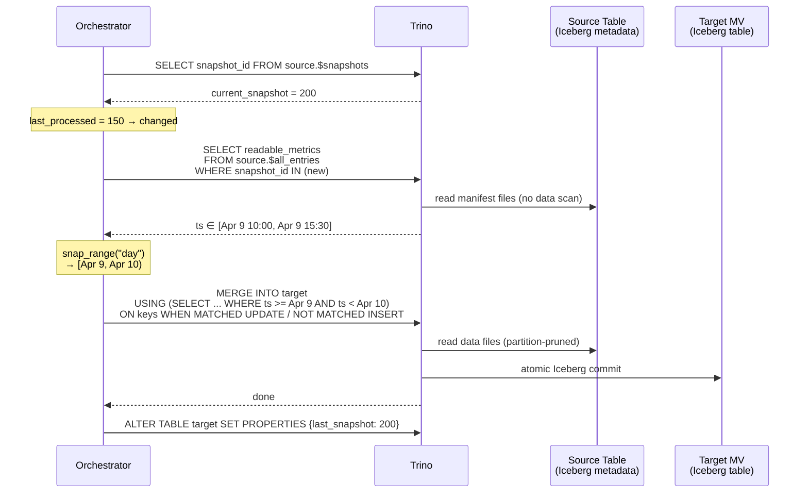
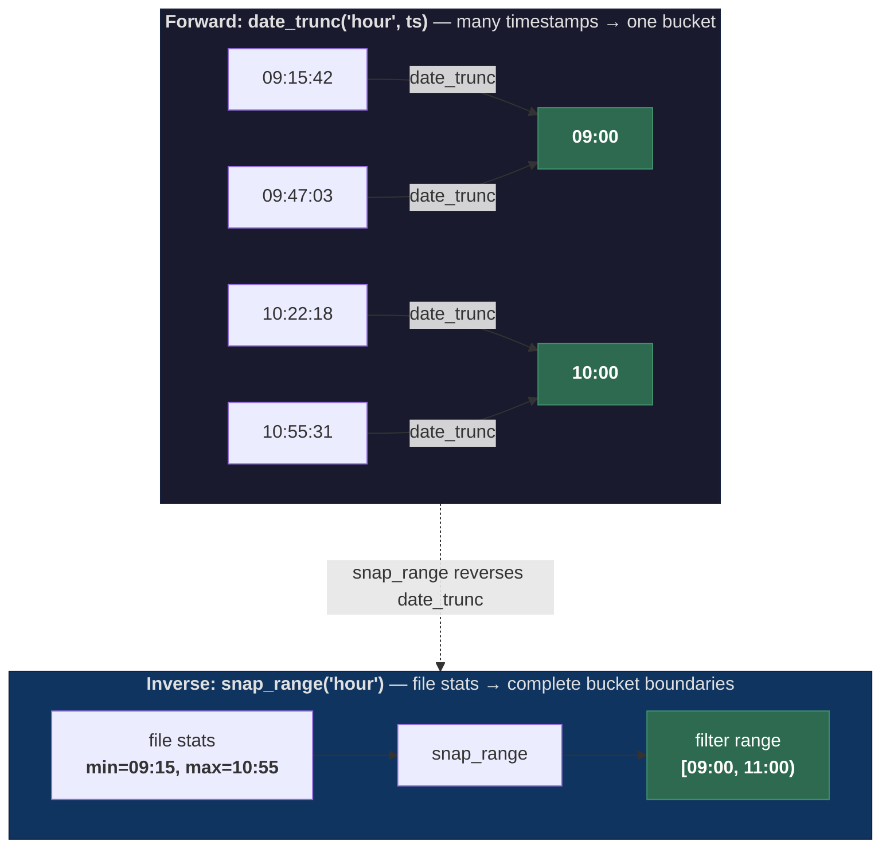
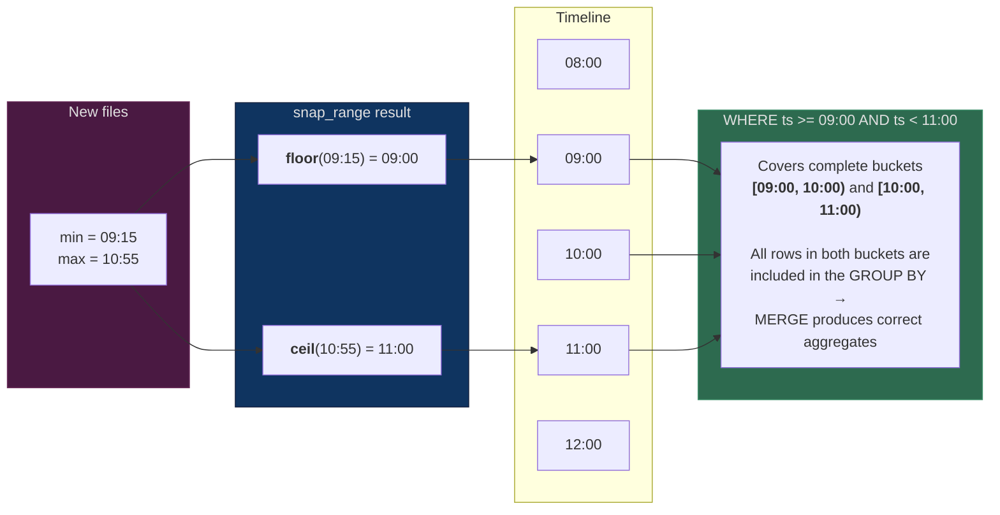
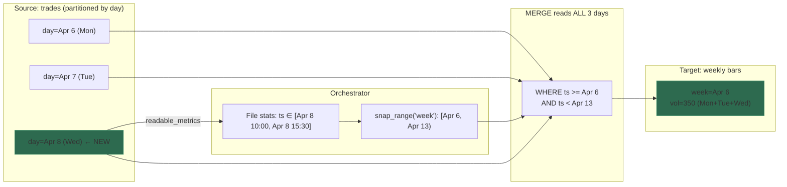

# trino-mv-orchestrator

Metadata-driven incremental materialized view orchestrator for Trino/Iceberg.

Maintains materialized views backed by Iceberg tables, refreshed incrementally
using only Iceberg file-level metadata for change detection. When source data
changes, only the affected time range is recomputed from complete source data,
guaranteeing correct aggregations. Refreshes are atomic via `MERGE INTO`.

> This project was designed and implemented through a conversation between a
> human prompter and Claude Code. See [DESIGN.md](DESIGN.md) for the full
> design rationale and conversation context.

## How it works



1. **Detect** -- query `$snapshots` to check if source changed (<50ms)
2. **Measure** -- read `$all_entries` for new files' column-level min/max bounds (metadata only)
3. **Snap** -- expand the time range to complete GROUP BY bucket boundaries (pure Python)
4. **Refresh** -- `MERGE INTO` with a plain column range filter (Trino pushes down to partition pruning)
5. **Persist** -- store snapshot ID in target table's Iceberg properties

### `date_trunc` and `snap_range`: forward and inverse

The entire incremental refresh correctness depends on one thing: given the
min/max timestamps from new files, compute a filter range that covers **every
complete GROUP BY bucket** touched by that data. This is done by inverting
the `date_trunc` function used in the query's GROUP BY.



`date_trunc` is a **many-to-one** function: it maps every timestamp within a
bucket to the same boundary value. `snap_range` is its inverse: it expands a
raw timestamp range outward to the nearest bucket boundaries so the filter
captures all rows that belong to any touched bucket.



The two operations mirror each other exactly:

| | `date_trunc('hour', ts)` | `snap_range('hour')` |
|---|---|---|
| **Direction** | timestamp → bucket start | timestamp range → bucket-aligned range |
| **Operation** | floor to `:00:00` | floor min to `:00:00`, ceil max to next `:00:00` |
| **Used in** | `GROUP BY` (query) | `WHERE` filter (orchestrator) |
| **Guarantees** | rows are grouped by hour | filter covers complete hours |

This is why only simple `date_trunc` is allowed: for any `date_trunc('X', col)`,
the inverse is trivially computable by `snap_range('X')`. Complex expressions
(e.g. 5-minute bars via arithmetic) break this — the bucket width can't be
reliably inferred, and the inverse would produce a too-narrow filter that
corrupts aggregates.

## Quick start

```bash
uv sync
uv run trino-mv-orchestrator -c config.yaml
# Web UI:  http://localhost:8000
# Metrics: http://localhost:8000/metrics
```

### Trino prerequisite

```properties
# etc/catalog/iceberg.properties
iceberg.allowed-extra-properties=mv.last_source_snapshot
```

### Minimal view definition

```yaml
trino:
  host: localhost
  port: 8080
  catalog: iceberg
  schema: analytics
  user: orchestrator

views:
  - name: ohlcv_1m
    source_table: iceberg.market_data.trades
    filter_column: ts
    query: |
      SELECT
        symbol,
        date_trunc('minute', ts) AS minute,
        min_by(price, ts) AS open, max(price) AS high,
        min(price) AS low, max_by(price, ts) AS close,
        sum(quantity) AS volume, count(*) AS trade_count
      FROM iceberg.market_data.trades
      WHERE {range_filter}
      GROUP BY 1, 2
    merge_keys: [symbol, minute]
```

`filter_granularity` is always inferred from `date_trunc('X', col)` in the query.
Only simple `date_trunc` expressions are supported — complex arithmetic expressions
are rejected. See [Granularity inference](#granularity-inference) for details.

The orchestrator auto-discovers column types (`DESCRIBE OUTPUT`), creates the
target table, and starts refreshing. Views can also be managed from the web UI.

### Configuration reference

| Field | Required | Description |
|---|---|---|
| `name` | yes | Unique view name |
| `source_table` | yes | Fully qualified Iceberg source table |
| `filter_column` | yes | Column to read min/max stats for (must have Iceberg column stats) |
| `filter_granularity` | -- | Always inferred from `date_trunc('X', col)` in the query. Supported: `minute`, `hour`, `day`, `week`, `month`, `quarter`, `year`. |
| `query` | yes | SELECT with `{range_filter}` placeholder in WHERE clause |
| `merge_keys` | yes | Columns forming the MERGE ON clause (must be unique in output) |
| `target_table` | no | Defaults to `{catalog}.{schema}.{name}` |
| `target_partitioning` | no | Defaults to source table's partitioning |
| `refresh_interval_seconds` | no | Defaults to 60 |

### API

| Endpoint | Method | Description |
|---|---|---|
| `/` | GET | Web UI |
| `/api/views` | GET | List all views with status |
| `/api/views` | POST | Create a new view |
| `/api/views/{name}` | DELETE | Remove a view |
| `/api/views/{name}/refresh` | POST | Trigger manual refresh |
| `/metrics` | GET | Prometheus metrics |
| `/health` | GET | Health check |

### Prometheus metrics

| Metric | Type | Labels |
|---|---|---|
| `mv_refresh_total` | counter | view, type(full/incremental/skip) |
| `mv_refresh_duration_seconds` | histogram | view |
| `mv_refresh_last_success_timestamp` | gauge | view |
| `mv_refresh_errors_total` | counter | view |
| `mv_config_reload_total` | counter | |
| `mv_views_configured` | gauge | |

## Cross-partition GROUP BY

The tool correctly handles GROUP BY expressions coarser than the source
partition granularity (e.g. weekly bars from a daily-partitioned table).



The inferred `filter_granularity` (`week`) snaps the file-stats range to complete
week boundaries, so the MERGE query reads Mon+Tue+Wed and produces a correct
weekly bar.

## Granularity inference

The orchestrator parses `date_trunc('X', col)` from the query and uses `X` as
the granularity. This is always automatic — there is no manual override.

```
date_trunc('minute', ts) AS minute     →  minute
date_trunc('hour', ts) AS hour         →  hour
date_trunc('day', ts) AS day           →  day
date_trunc('week', ts) AS week         →  week
date_trunc('month', ts) AS month       →  month
date_trunc('quarter', ts) AS quarter   →  quarter
date_trunc('year', ts) AS year         →  year
```

Only simple `date_trunc('X', col)` is allowed. Complex arithmetic expressions
around `date_trunc` (e.g. 5-minute bars via subtraction) are **rejected** because
the bucket width cannot be reliably inferred, leading to correctness issues with
partial-bucket refreshes.

## Limitations

### Query shape

The query must be a `SELECT ... GROUP BY` over a **single source table** with
a `{range_filter}` in the WHERE clause.

### Not supported

- **Joins** -- change detection tracks one source table only
- **Non-time GROUP BY** -- `GROUP BY symbol` with no time component degrades
  to near-full-refresh on every change
- **Source deletes/overwrites** -- detected via `$snapshots`, triggers full
  refresh (correct but expensive)
- **Missing column stats** -- if the source writer disables Iceberg column
  statistics, the detector can't determine the affected range

### Assumptions

- **Append-only sources** (trades, logs, events)
- **Iceberg v2** (required for MERGE)
- Source files have column-level min/max statistics (default in Parquet)

## Tests

```bash
# Unit tests only
uv run pytest tests/unit/ -v

# Full suite (requires docker compose)
cd tests && docker compose up -d
cd .. && uv run pytest tests/ -v
cd tests && docker compose down -v
```

## Project structure

```
src/trino_mv_orchestrator/
    config.py        -- YAML config loading, saving, validation
    detector.py      -- $snapshots + $all_entries file stats + snap_range()
    executor.py      -- MERGE SQL generation + execution
    introspect.py    -- DESCRIBE OUTPUT, EXPLAIN IO, SHOW CREATE TABLE
    state.py         -- Read/write last_source_snapshot via extra_properties
    server.py        -- FastAPI: web UI, REST API, Prometheus, refresh loop
    cli.py           -- Entry point, starts uvicorn
    static/
        index.html   -- Web UI (Tailwind CSS + Alpine.js)
tests/
    unit/            -- 43 tests (mock cursors, FastAPI test client)
    integration/     -- 10 e2e tests (Trino + Iceberg + MinIO via docker compose)
```
