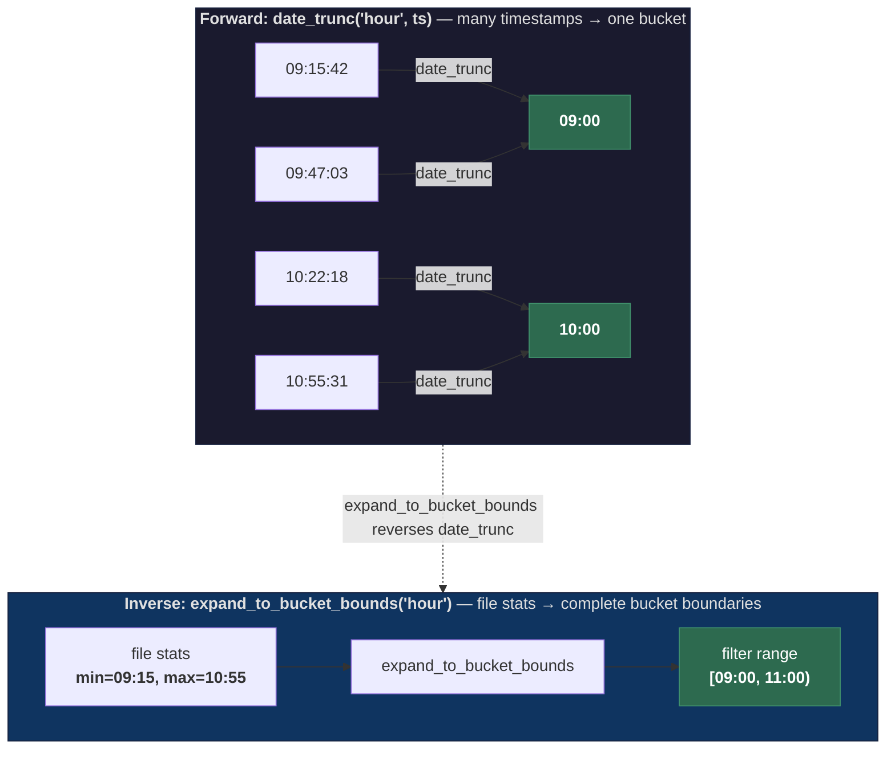
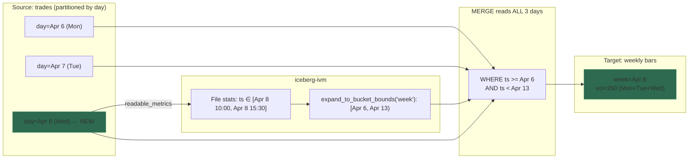

# iceberg-ivm

A simple **Iceberg IVM (incremental view maintenance) controller** that delegates
all computation to Trino.

The service owns the control plane — view definitions, change detection,
refresh scheduling, watermarks — while Trino executes the actual SQL against
Iceberg tables. Change detection runs on Iceberg file-level metadata only;
when source data changes, only the affected time range is recomputed from
complete source data, guaranteeing correct aggregations. Refreshes are atomic
via `MERGE INTO`.

**Lightweight by design.** The service itself moves no data and holds no
table contents — it only reads Iceberg metadata (`$snapshots`, `$all_entries`)
and issues SQL to Trino. All data lives in Iceberg; all scans and writes
happen inside Trino. Its resident state is a handful of per-view status
counters.

**Materialized views are Iceberg tables, which makes them chainable.** Because
each target is a first-class Iceberg table, it can be the *source* of another
view. Example: a `trades → 1-minute bars` MV feeding a `1-minute → 1-hour
bars` MV. The second view only needs metadata from the first's target table,
so the chain stays cheap: each hop is still a bounded `MERGE` on a snapped
time range.

> This project was designed and implemented through a conversation between a
> human prompter and Claude Code. See [DESIGN.md](DESIGN.md) for the full
> design rationale and conversation context.

## Why this project exists

There's a specific, unfilled niche in the Iceberg + Trino ecosystem: **metadata-driven, bucket-aware incremental refresh of aggregating materialized views**. Each existing option falls short in a different way:

| Option | Gap |
|---|---|
| **Trino native Iceberg MVs** ([REFRESH MATERIALIZED VIEW](https://trino.io/docs/current/sql/refresh-materialized-view.html)) | Incremental path is append-style — the planner falls back to full refresh when the query aggregates. The open issue [trinodb/trino#18673](https://github.com/trinodb/trino/issues/18673) tracks exactly this gap. |
| **Hive Iceberg MVs** ([Cloudera blog](https://www.cloudera.com/blog/technical/accelerating-queries-on-iceberg-tables-with-materialized-views.html)) | Incremental rebuild of aggregations exists, but only for **decomposable aggregates** (SUM/MIN/MAX/COUNT/AVG) via additive delta merge — and it **fails on compaction** because it can't tell the new snapshot's intent. |
| **SQLMesh `INCREMENTAL_BY_TIME_RANGE`** | Bucket-aware by design, but the change signal is a **cron interval**, not Iceberg metadata. Late data needs a manually widened `lookback`. Doesn't read `$snapshots` or file-level statistics. |
| **dbt-trino incremental models** | The `is_incremental()` predicate is whatever SQL the user writes. No Iceberg snapshot or file-stats integration; no bucket-snapping; no concept of "compaction is a no-op". |

This project combines three things no other option does together:

1. **Read Iceberg file-level min/max stats** (`$all_entries.readable_metrics`) to find the exact time range of new data — never scans the data itself for change detection.
2. **Snap that range outward to complete GROUP BY bucket boundaries** so re-aggregation produces correct results, regardless of how the source is partitioned.
3. **Recompute the affected buckets from full source data via `MERGE`** — works for any aggregate (including non-decomposable ones like `min_by`, `max_by`, percentiles), and tolerates compaction by treating `replace` snapshots as no-ops.

The result is a small, sharply-scoped service: append-only Iceberg sources, `date_trunc`-bucketed aggregations, Trino as the executor. No DAG, no second CLI, no fork of the engine.

## Run it (TL;DR)

Pre-requisite: an existing Trino cluster reachable from the container.

Put `config.yaml` and `views.yaml` in a directory you'll mount into the
container (state survives across image bumps because both files — and
iceberg-ivm's `state.db` — live there):

```yaml
# ./data/config.yaml
server:
  port: 8000
trino:
  catalog: iceberg
  schema: analytics
```

```yaml
# ./data/views.yaml
views: []     # add views here, or manage them via the web UI
```

```yaml
# docker-compose.yml
services:
  iceberg-ivm:
    image: jonasbrami/iceberg-ivm:0.2.1
    environment:
      TRINO_URL: http://trino:8080
      TRINO_USER: iceberg-ivm
      # TRINO_PASSWORD: …            # only if your Trino requires it
    volumes:
      - ./data:/data
    command: ["-c", "/data/config.yaml", "--views", "/data/views.yaml"]
    ports:
      - "8000:8000"
```

```bash
docker compose up -d
open http://localhost:8000          # web UI
curl localhost:8000/health          # → {"status":"ok","views":0}
```

For a full local stack with a sandbox Trino + MinIO + Postgres, see
[Quick start](#quick-start) below.

## How it works


1. **Detect** -- query `$snapshots` to check if source changed (<50ms)
2. **Measure** -- read `$all_entries` for new files' column-level min/max bounds (metadata only)
3. **Snap** -- expand the time range to complete GROUP BY bucket boundaries (pure Python)
4. **Refresh** -- `MERGE INTO` with a plain column range filter (Trino pushes down to partition pruning)
5. **Persist** -- store snapshot ID in target table's Iceberg properties

### Iceberg metadata: what we read and why

The service treats Iceberg's metadata tables as a small, structured
log it can poll cheaply. It never scans source *data* for change
detection — just the metadata describing what data exists.

| Table | What we read | What it tells us |
|---|---|---|
| `source.$snapshots` | `(snapshot_id, operation, committed_at)` | Did the source change since our last refresh? And was the change a legitimate `append`, a `replace` (compaction — no new data), or something else (`overwrite` / `delete`, which we reject)? |
| `source.$all_entries` | `readable_metrics` JSON on files added in new snapshots (filtered by `snapshot_id IN (new)` and `status = 1`) | Per-file column-level min/max bounds. Gives us the tightest `[min_ts, max_ts]` bracket over the new data without reading a single data file. |

**Why `$all_entries` and not `$partitions`?** An earlier prototype diffed
`$partitions` between snapshots — but when the GROUP BY granularity is
coarser than the source partitioning (e.g. weekly bars from a daily-
partitioned source), a per-partition filter reads only the changed
partition and miscomputes the aggregate. File-level min/max is
granularity-independent: the detector always gets the real time range
of the new data regardless of how the source is partitioned.

**Sample `readable_metrics`** (one row per file in `$all_entries`):

```json
{
  "ts":     {"lower_bound": "2026-04-08T10:00:41+00:00",
             "upper_bound": "2026-04-08T15:59:50+00:00"},
  "price":  {"lower_bound": 138.5,  "upper_bound": 260.0},
  "symbol": {"lower_bound": "AAPL", "upper_bound": "TSLA"}
}
```

The detector pulls the `filter_column`'s `lower_bound` / `upper_bound`
across every new file, takes the chronological min of the lowers and
max of the uppers, then hands those two timestamps to
`expand_to_bucket_bounds(…)` (the `date_trunc` inverse — see next
section) to produce a bucket-aligned filter range. The range becomes
literal `TIMESTAMP` values in the `MERGE`'s WHERE, which Trino's
planner pushes straight down to Iceberg partition pruning.

### `date_trunc` and `expand_to_bucket_bounds`: forward and inverse

The entire incremental refresh correctness depends on one thing: given the
min/max timestamps from new files, compute a filter range that covers **every
complete GROUP BY bucket** touched by that data. This is done by inverting
the `date_trunc` function used in the query's GROUP BY.



`date_trunc` is a **many-to-one** function: it maps every timestamp within a
bucket to the same boundary value. `expand_to_bucket_bounds` is its inverse: it expands a
raw timestamp range outward to the nearest bucket boundaries so the filter
captures all rows that belong to any touched bucket.


The two operations mirror each other exactly:

| | `date_trunc('hour', ts)` | `expand_to_bucket_bounds('hour')` |
|---|---|---|
| **Direction** | timestamp → bucket start | timestamp range → bucket-aligned range |
| **Operation** | floor to `:00:00` | floor min to `:00:00`, ceil max to next `:00:00` |
| **Used in** | `GROUP BY` (query) | `WHERE` filter (iceberg-ivm) |
| **Guarantees** | rows are grouped by hour | filter covers complete hours |

This is why only simple `date_trunc` is allowed: for any `date_trunc('X', col)`,
the inverse is trivially computable by `expand_to_bucket_bounds('X')`. Complex expressions
(e.g. 5-minute bars via arithmetic) break this — the bucket width can't be
reliably inferred, and the inverse would produce a too-narrow filter that
corrupts aggregates.

## Requirements

- **Trino** with the Iceberg connector enabled — recent versions are recommended for `$all_entries` / `readable_metrics`.
- **Iceberg catalog supporting writes from Trino** — Hive Metastore, REST, Nessie, Polaris, Snowflake Open Catalog, or JDBC.
- **Trino user** with the following privileges:
  - `SELECT` on every source table (plus its `$snapshots`, `$all_entries` metadata tables — these inherit from the base-table grant in Trino's Iceberg connector).
  - `CREATE TABLE` on the target schema — iceberg-ivm creates the target on first refresh.
  - `SELECT`, `INSERT`, `DELETE`, `UPDATE` on every target table — needed for `MERGE` (incremental) and `DELETE + INSERT` (full refresh).
- **Iceberg column statistics** on the source `filter_column` — the detector reads `readable_metrics` from `$all_entries`. Statistics are on by default for Trino and Spark ≥ 3.5 writers.
- **Python ≥ 3.12** — only when running from source (the Docker image does not require this on the host).

## Quick start

### 1. Set Trino credentials (environment variables)

Trino URL, user, and password are read **only** from the environment. They
never appear in `config.yaml`, so secrets stay out of the repo and
per-environment deployments only need to set a few env vars.

| Variable | Required | Notes |
|---|---|---|
| `TRINO_URL` | yes | Coordinator URL, e.g. `http://trino:8080` or `https://trino.prod:8443`. Scheme determines `http` vs `https`. |
| `TRINO_USER` | yes | Trino username. |
| `TRINO_PASSWORD` | no | BasicAuth password. Omit (or leave empty) for anonymous access — e.g. the local dev compose stack. |

The service refuses to start if `TRINO_URL` or `TRINO_USER` is missing.

### 2. Create two YAML files

**`config.yaml`** — server settings + per-deployment Trino *catalog* and
*schema* (not secrets; see [`config.yaml.example`](config.yaml.example)):

```yaml
server:
  port: 8000
  config_reload_interval_seconds: 30
trino:
  catalog: iceberg
  schema: analytics
```

**`views.yaml`** — the views to maintain. Write each `query` *exactly* as you
would after `CREATE MATERIALIZED VIEW … AS`:

```yaml
views:
  - name: ohlcv_1m
    query: |
      SELECT
        symbol,
        date_trunc('minute', ts) AS minute,
        min_by(price, ts) AS open, max(price) AS high,
        min(price) AS low,        max_by(price, ts) AS close,
        sum(quantity) AS volume,  count(*) AS trade_count
      FROM iceberg.market_data.trades
      GROUP BY symbol, date_trunc('minute', ts)
    refresh_interval_seconds: 30
```

The service parses each query and derives `source_table`, `filter_column`,
`filter_granularity`, and `merge_keys` from it. At refresh time the time-range
WHERE predicate is AST-injected automatically — there is no `{range_filter}`
placeholder. Column types are auto-discovered via `DESCRIBE OUTPUT` and the
target table is created on first run.

Views can also be managed interactively from the web UI.

### 3. Run it

Install dependencies, export the credential env vars, and start the service:

```bash
uv sync
export TRINO_URL=http://localhost:8080
export TRINO_USER=iceberg-ivm
# export TRINO_PASSWORD=…            # only if your Trino requires it
uv run iceberg-ivm -c config.yaml --views views.yaml
# Web UI:  http://localhost:8000
# Metrics: http://localhost:8000/metrics
```

**CLI flags:**

| Flag | Default | Description |
|---|---|---|
| `-c`, `--config` | `config.yaml` | Path to the server + trino catalog/schema config |
| `--views` | `views.yaml` | Path to the views file (empty if absent) |
| `-v`, `--verbose` | off | Enable DEBUG logging |

The server port comes from `server.port` in `config.yaml`. Both files are
hot-reloaded on mtime change at `server.config_reload_interval_seconds` (default
30s) — no restart needed when adding/editing views.

### Running against a local Trino stack

A `tests/docker-compose.yml` brings up Trino + MinIO + Postgres for local
development:

```bash
cd tests && docker compose up -d trino
# Trino UI: http://localhost:18080
# Seed sample data + generate config/views:
cd ..
uv run --with trino python tests/seed_data.py

# The compose Trino accepts any user without a password, so TRINO_PASSWORD
# stays unset:
export TRINO_URL=http://localhost:18080
export TRINO_USER=demo
uv run iceberg-ivm -c config.yaml --views views.yaml
```

## Using it

### The web UI

Open http://localhost:8000 after starting the service. You get a single-page app listing every configured view:

- **Header** — view count, poll cadence, a **New View** button that opens the create-view modal.
- **View cards** — one per view, showing:
  - name and a status badge (`pending`, `idle`, `incremental`, `full`, `error`)
  - `source → target` qualified table names
  - stats row: total `Refreshes`, last `Duration`, polled `Interval`, `Last` refresh timestamp, cumulative `Errors`
  - **Refresh / Edit / Delete** buttons
  - a collapsible **query** panel with the raw SQL
  - a collapsible **recent queries (N)** panel with one row per refresh-time query (`merge`, `chunk_merge`, or `maintenance_<op>`) — click any row to open that query in the Trino UI
- **Live query parsing** — while you type in the create/edit modal, a debounced panel under the query textarea shows the parser's derived `source`, `filter col`, `granularity`, and `merge keys`, or a red parse error.
- **Refresh toast** — clicking Refresh pops a small bottom-right toast reporting the action (`no changes` / `incremental refresh` / `full refresh` / error message).

### Managing views — two paths

Both write to the same `views.yaml`, so you can mix freely:

| Path | When | Notes |
|---|---|---|
| Edit `views.yaml` on disk | Version-controlled deploys; bulk changes | Hot-reloaded on mtime change every `config_reload_interval_seconds` (default 30s) — no restart needed. |
| Web UI / REST API | Exploratory / ops workflows | `POST /api/views`, `DELETE /api/views/{name}`, `POST /api/views/{name}/refresh`. Writes to `views.yaml` atomically. |

### How the refresh loop actually runs

One asyncio task ticks every **1 second**. On each tick:

- If `config_reload_interval_seconds` has elapsed since the last reload, re-read `config.yaml` + `views.yaml`.
- For each configured view, if `refresh_interval_seconds` has elapsed since its last refresh, run one refresh cycle.

Refreshes are **sequential** — one view at a time, no pool, no queue. A single slow refresh delays the next tick's scheduling; plan `refresh_interval_seconds` accordingly.

### What the first run looks like

On the first refresh of a brand-new view you'll see:

1. `discover_columns` (a `PREPARE` + `DESCRIBE OUTPUT`, no data scan) resolves the target column types.
2. `CREATE TABLE IF NOT EXISTS target (…)` creates the Iceberg table. The target is **unpartitioned by default**; set `target_partitioning` on the view to partition it (e.g. `"ARRAY['day(minute)']"`).
3. The detector sees no `last_source_snapshot` recorded in iceberg-ivm's `state.db` and returns `FULL_REFRESH`.
4. `execute_full_refresh` runs `DELETE FROM target WHERE true` then `INSERT INTO target SELECT …` (your original query, verbatim — no WHERE injected).
5. The source snapshot ID is written to `state.db` (`view_status.last_source_snapshot`).

Every subsequent cycle is incremental unless you delete the bookmark.

### Day-2 operations

| Task | How |
|---|---|
| Add / edit a view | Edit `views.yaml` (or use UI / API). Takes effect at next config reload. |
| Delete a view | UI → Delete, or `DELETE /api/views/{name}`. Removes it from the schedule **only** — the target Iceberg table is untouched. Drop it separately if you want the data gone. |
| Force a full refresh | Delete the view via the UI / `DELETE /api/views/{name}` and recreate it (this clears the SQLite bookmark), then `DROP TABLE <target>` if you also want the data gone. Just dropping the target by itself will not full-refresh — the next tick will incremental-refresh against an empty table. |
| Restart iceberg-ivm | Safe. The bookmark lives in `state.db` (mounted alongside `views.yaml`); restart picks up where it left off. |
| Manual refresh | UI → Refresh, or `POST /api/views/{name}/refresh`. Runs one cycle synchronously and returns the action taken. |
| Health check | `curl http://localhost:8000/health` → `{"status":"ok","views":N}` |

### Deployment notes

- **Single-instance.** iceberg-ivm is not HA. One process per target catalog/schema. Two instances against the same targets would race on `ALTER TABLE SET PROPERTIES` and produce conflicting MERGEs.
- **Crash-safe.** Refresh-correctness state lives in Iceberg, not in iceberg-ivm. Kill/restart leaves no cleanup.
- **Persist the SQLite state DB.** The UI's "recent queries" panel is backed by a SQLite file (`server.state_db_path`, default `state.db` next to `config.yaml`). If you run in docker, mount a volume at that path — otherwise the file is recreated empty on every container replacement and history disappears. Example: `-v ivm-state:/app/state.db`.
- **What to monitor** (all labels `view`):
  - `rate(mv_refresh_errors_total[5m]) > 0` — refresh is failing.
  - `time() - mv_refresh_last_success_timestamp > 3 * refresh_interval_seconds` — view is stalled.
  - `histogram_quantile(0.95, rate(mv_refresh_duration_seconds_bucket[10m]))` — refresh tail latency; unexpected growth usually means a partition scan you didn't plan for.

### Configuration reference

| Field | Required | Description |
|---|---|---|
| `name` | yes | Unique view name |
| `query` | yes | The full SELECT — exactly what you would write after `CREATE MATERIALIZED VIEW … AS`. `source_table`, `filter_column`, `filter_granularity`, and `merge_keys` are derived from this |
| `target_table` | no | Defaults to `{catalog}.{schema}.{name}` |
| `target_partitioning` | no | Iceberg `ARRAY[...]` string for the target table's partitioning (e.g. `"ARRAY['day(minute)']"`). Unpartitioned if omitted — iceberg-ivm does not auto-inherit from the source, because the source's partition column is typically consumed by `date_trunc(...)` and no longer exists on the target (see issue #22). |
| `refresh_interval_seconds` | no | Defaults to 60 |

### API

| Endpoint | Method | Description |
|---|---|---|
| `/` | GET | Web UI |
| `/api/views` | GET | List all views with status |
| `/api/views` | POST | Create a new view |
| `/api/views/{name}` | DELETE | Remove a view |
| `/api/views/{name}/refresh` | POST | Trigger manual refresh |
| `/metrics` | GET | Prometheus metrics |
| `/health` | GET | Health check |

### Prometheus metrics

| Metric | Type | Labels |
|---|---|---|
| `mv_refresh_total` | counter | view, type(full/incremental/skip) |
| `mv_refresh_duration_seconds` | histogram | view |
| `mv_refresh_last_success_timestamp` | gauge | view |
| `mv_refresh_errors_total` | counter | view |
| `mv_config_reload_total` | counter | |
| `mv_views_configured` | gauge | |

## Cross-partition GROUP BY

The tool correctly handles GROUP BY expressions coarser than the source
partition granularity (e.g. weekly bars from a daily-partitioned table).



The inferred `filter_granularity` (`week`) snaps the file-stats range to complete
week boundaries, so the MERGE query reads Mon+Tue+Wed and produces a correct
weekly bar.

## Query parsing

At config-load time iceberg-ivm parses every view query with an AST-based
parser (`sqlparse`). It derives:

- `source_table` — from the FROM clause
- `filter_column` — the bare column inside `date_trunc('X', col)`
- `filter_granularity` — the `'X'` literal (one of `minute`, `hour`, `day`,
  `week`, `month`, `quarter`, `year`)
- `merge_keys` — resolved from the GROUP BY list against the projection
  (positional `GROUP BY 1, 2` refs are handled too)

At refresh time iceberg-ivm AST-injects the time-range `WHERE` predicate
directly into the query:

```sql
-- operator writes:
SELECT symbol, date_trunc('week', ts) AS week, sum(qty) AS volume
FROM iceberg.md.trades
WHERE color = 'red'
GROUP BY 1, 2

-- iceberg-ivm runs:
MERGE INTO iceberg.md.trades_weekly AS t USING (
  SELECT symbol, date_trunc('week', ts) AS week, sum(qty) AS volume
  FROM iceberg.md.trades
  WHERE color = 'red'
    AND ts >= TIMESTAMP '2026-04-06 00:00:00.000000 UTC'
    AND ts < TIMESTAMP '2026-04-13 00:00:00.000000 UTC'
  GROUP BY 1, 2
) AS s ON t.symbol = s.symbol AND t.week = s.week …
```

## Example queries

### ✅ Supported

**Minute-level OHLCV bars:**
```sql
SELECT
  symbol,
  date_trunc('minute', ts) AS minute,
  min_by(price, ts) AS open, max(price) AS high,
  min(price) AS low,         max_by(price, ts) AS close,
  sum(quantity) AS volume,   count(*) AS trade_count
FROM iceberg.market_data.trades
GROUP BY symbol, date_trunc('minute', ts)
```

**Weekly bars from a daily-partitioned source** — the detector expands the
file-stats range to full week boundaries:
```sql
SELECT symbol, date_trunc('week', ts) AS week, sum(quantity) AS volume
FROM iceberg.market_data.trades
GROUP BY 1, 2
```

**Pre-filtered view** (your `WHERE` is preserved; iceberg-ivm `AND`s the
time-range predicate onto it):
```sql
SELECT symbol, date_trunc('hour', ts) AS hour, count(*) AS c
FROM iceberg.md.trades
WHERE status = 'settled'
GROUP BY 1, 2
```

**Positional GROUP BY** (resolves to projection aliases — merge keys become
`['symbol', 'day']`):
```sql
SELECT symbol, date_trunc('day', ts) AS day, sum(qty) AS v
FROM iceberg.md.trades
GROUP BY 1, 2
```

**Chained MV** (a view whose source is another view's target — since every
target is an Iceberg table, it's a normal source for the next hop):
```sql
SELECT symbol, date_trunc('hour', bucket) AS hour_bucket,
       min_by(open, bucket) AS open, max(high) AS high,
       min(low) AS low,       max_by(close, bucket) AS close,
       sum(volume) AS volume, sum(trade_count) AS trade_count
FROM iceberg.analytics.ohlcv_1m
GROUP BY 1, 2
```
Note: avoid naming the upstream MV's time column with a SQL reserved word
(`minute`, `hour`, `day`, `week`, `month`, `quarter`, `year`) — the parser
rejects bare reserved words as the second arg of `date_trunc(...)`. Use a
non-reserved alias like `bucket` or `minute_ts` in the upstream view.

### ❌ Not supported — rejected at config load

**Joins** (change detection only watches one source — other tables' changes
would be silently missed):
```sql
SELECT t.symbol, date_trunc('day', t.ts) AS day, count(*)
FROM trades t JOIN symbols s ON t.symbol = s.ticker
GROUP BY 1, 2
```

**CTEs / `WITH` clauses:**
```sql
WITH filtered AS (SELECT * FROM trades WHERE price > 0)
SELECT date_trunc('day', ts) AS day, count(*)
FROM filtered
GROUP BY 1
```

**Subquery in FROM:**
```sql
SELECT date_trunc('day', ts) AS day, count(*)
FROM (SELECT ts FROM trades WHERE price > 0) s
GROUP BY 1
```

**Set operations** (`UNION` / `INTERSECT` / `EXCEPT`):
```sql
SELECT date_trunc('day', ts) AS day FROM trades_us
UNION ALL
SELECT date_trunc('day', ts) AS day FROM trades_eu
```

**`date_trunc` wrapped in arithmetic** — the canonical 5-minute-bars mistake.
The bucket width can't be reliably inferred, so the inverse would produce a
too-narrow filter that corrupts aggregates:
```sql
SELECT date_trunc('minute', ts) - (extract(minute FROM ts) % 5) * INTERVAL '1' MINUTE AS bar
FROM trades
GROUP BY 1
```

**Multiple distinct granularities in one view** — a view has a single
granularity:
```sql
SELECT date_trunc('day', ts) AS d, date_trunc('hour', ts) AS h, count(*)
FROM trades
GROUP BY 1, 2
```

**Computed projection without an alias** — the target-table column would get
an auto-generated name like `_col0`:
```sql
SELECT date_trunc('day', ts), count(*)
FROM trades
GROUP BY 1
```

**No `date_trunc` / no `GROUP BY`** — the correctness model requires both:
```sql
SELECT symbol, price FROM trades
```

## Limitations

### Query shape

The query must be a `SELECT … GROUP BY` over a **single source table**. The
parser enforces this at load time and rejects anything else with a clear error.

### Not supported

- **Joins.** The query must reference exactly one source table. Change
  detection only inspects the parsed source table; if a query joined a second
  table, updates to that other table would never trigger a refresh and the MV
  would silently go stale. Parser rejects queries containing `JOIN`.
- **Set operations** (`UNION` / `INTERSECT` / `EXCEPT`) — rejected at parse.
- **CTEs** (`WITH …`) — rejected at parse.
- **Subqueries in FROM** — rejected at parse.
- **Queries without `GROUP BY`** — rejected at parse. The correctness model
  is built around `date_trunc('X', col)` defining aggregation buckets.
- **`date_trunc` wrapped in arithmetic** (e.g. 5-minute bars via
  `date_trunc(...) - INTERVAL ...`) — rejected at parse because the bucket
  width cannot be reliably inferred.
- **Projection columns without an alias on computed expressions** — rejected
  so the target-table columns have stable names.
- **Source deletes/overwrites** — detected via `$snapshots`, raises
  `UnexpectedOperationError` (the project assumes append-only sources).
- **Missing column stats** — if the source writer disables Iceberg column
  statistics, the detector can't determine the affected range and raises
  `MissingFilterColumnError`.

### Assumptions

- **Append-only sources** (trades, logs, events). Only Iceberg `append` and
  `replace` (compaction) snapshot operations are allowed. `replace` is
  skipped — files were rewritten but no data changed. Any other operation
  (`overwrite`, `delete`) fails loudly.
- **UTC session timezone.** iceberg-ivm pins every Trino session to
  `UTC` so that `date_trunc('day' | 'week' | …, ts)` on `TIMESTAMP WITH
  TIME ZONE` columns aligns with the Python-side `expand_to_bucket_bounds` bucket math.
  Without this pin, a non-UTC session would produce bucket boundaries
  that disagree with the computed filter range and silently corrupt
  incremental aggregates. See [DESIGN.md](DESIGN.md#timezone-assumption).
- **Iceberg v2** (required for MERGE)
- Source files have column-level min/max statistics (default in Parquet)

## Tests

```bash
# Unit tests only
uv run pytest tests/unit/ -v

# Full suite (requires docker compose)
cd tests && docker compose up -d
cd .. && uv run pytest tests/ -v
cd tests && docker compose down -v
```

## Project structure

```
src/iceberg_ivm/
    config.py        -- YAML config loading, saving, validation
    detector.py      -- $snapshots + $all_entries file stats + expand_to_bucket_bounds()
    executor.py      -- MERGE SQL generation + execution
    introspect.py    -- DESCRIBE OUTPUT, EXPLAIN IO, SHOW CREATE TABLE
    query_history.py -- SQLite-backed view_status / query history / source-snapshot bookmark
    server.py        -- FastAPI: web UI, REST API, Prometheus, refresh loop
    cli.py           -- Entry point, starts uvicorn
    static/
        index.html   -- Web UI (Tailwind CSS + Alpine.js)
tests/
    unit/            -- 43 tests (mock cursors, FastAPI test client)
    integration/     -- 10 e2e tests (Trino + Iceberg + MinIO via docker compose)
```
